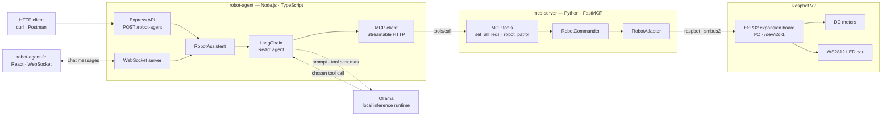
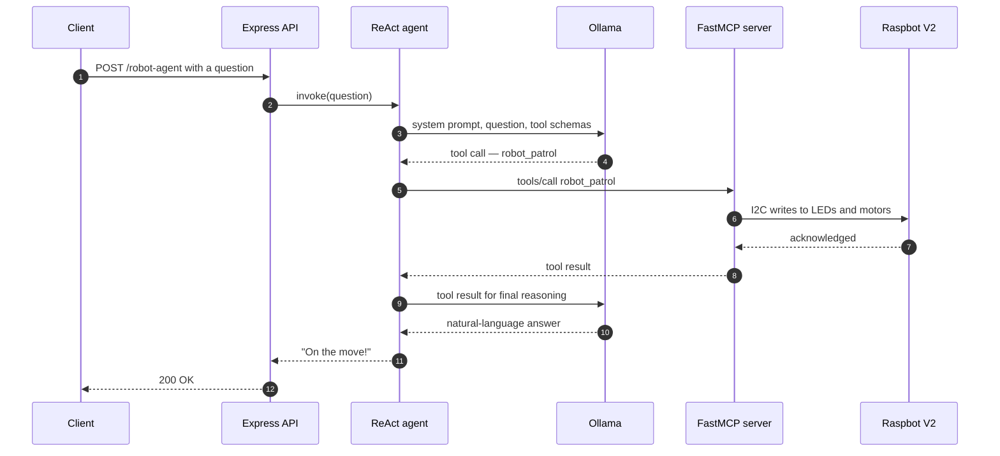

<h1 align="center">estudart-mcp-robot</h1>

<p align="center">
  <strong>Natural-language control for a physical robot.</strong><br>
  A local LLM turns plain English into motor and LED commands, delivered over the Model Context Protocol.
</p>

<p align="center">
  
  
  
  
  
  
  
  
</p>

<p align="center">
  
</p>

<p align="center">
  <sub>Raspbot V2 — image from the official <a href="https://github.com/YahboomTechnology/Raspbot-V2">YahboomTechnology/Raspbot-V2</a> repository.</sub>
</p>

---

## Overview

This project puts a large language model in direct control of physical hardware. You send a
sentence — *"patrol the room"*, *"turn the lights red"* — to an HTTP endpoint, and a locally hosted
model decides which of the robot's capabilities to invoke, calls them, and reports back on what it did.

The robot's capabilities are not hardcoded into the agent. They are published by a **FastMCP**
server as Model Context Protocol tools, discovered at runtime, and translated into I²C writes to
the robot's ESP32 expansion board. That separation means the AI layer knows nothing about wiring
or registers, and the hardware layer knows nothing about prompts or models.

Everything runs on your own machines. No cloud inference, no API keys.

## Architecture



The stack splits into two deployable services, each following the same layered structure —
**presentation** receives requests, **application** holds orchestration logic, **infrastructure**
owns every conversation with the outside world, and a composition root wires the three together.

| Component | Stack | Responsibility |
| --- | --- | --- |
| **robot-agent-fe** | React 19 · TypeScript · Vite | Browser chat UI, talks to the agent over a WebSocket connection |
| **robot-agent** | Node.js · TypeScript · Express 5 | Exposes the public HTTP/WebSocket API, runs the ReAct agent loop, and acts as the MCP client |
| **mcp-server** | Python 3.12 · FastMCP · uvicorn | Publishes robot capabilities as MCP tools and drives the hardware |
| **Ollama** | Host-native runtime | Serves the language model that chooses which tools to call |
| **Raspbot V2** | Raspberry Pi 5 · ESP32 board | Executes the physical work: drive motors and the LED bar |

### Request lifecycle



Tool schemas are fetched from the MCP server at startup and converted into LangChain structured
tools, so adding a capability to the Python server makes it available to the agent without a single
change on the TypeScript side.

## MCP tools

| Tool | Signature | Behaviour |
| --- | --- | --- |
| `set_all_leds` | `(color: str)` | Drives the full 14-LED bar to `RED`, `GREEN`, `BLUE`, `YELLOW`, `CYAN` or `WHITE` |
| `robot_patrol` | `()` | Scripted routine: green LEDs, forward, reverse, stop, red LEDs |
| `hello_world` | `()` | Connectivity smoke test for the MCP transport |

## Hardware

<table>
  <tr>
    <td width="50%" align="center" valign="middle">
      <a href="https://www.raspberrypi.com/products/raspberry-pi-5/">
        
      </a>
      <br><br>
      <strong>Raspberry Pi 5</strong><br>
      <sub>Hosts the FastMCP server and owns the I²C bus</sub>
    </td>
    <td width="50%" align="center" valign="middle">
      <a href="https://www.espressif.com/en/products/devkits/esp32-devkitc">
        
      </a>
      <br><br>
      <strong>ESP32-DevKitC</strong><br>
      <sub>Expansion-board controller driving the motors and LED bar</sub>
    </td>
  </tr>
</table>

<sub>
  Raspberry Pi 5 by <a href="https://commons.wikimedia.org/wiki/File:Raspberry_Pi_5.jpg">SimonWaldherr</a>,
  <a href="https://creativecommons.org/licenses/by/4.0/">CC BY 4.0</a>, via Wikimedia Commons ·
  ESP32-DevKitC board photo © <a href="https://github.com/espressif/esp-dev-kits">Espressif Systems</a>,
  <a href="https://github.com/espressif/esp-dev-kits/blob/master/LICENSE">Apache-2.0</a>.
</sub>

| Part | Detail |
| --- | --- |
| Chassis | Yahboom Raspbot V2 |
| Compute | Raspberry Pi 5 |
| Motor / LED controller | ESP32 expansion board, addressed over I²C on `/dev/i2c-1` |
| Lighting | 14-pixel WS2812 addressable bar |
| Driver library | [`raspbot`](https://nbourre.github.io/raspbotv2-lib) via `smbus2` |

The I²C device is mapped straight into the `mcp-server` container by `docker-compose.yml`, so the
Python service can talk to the board without privileged mode.

## Getting started

### Prerequisites

```bash
# uv — Python dependency and environment manager
curl -LsSf https://astral.sh/uv/install.sh | sh

# Node.js 20 or newer
node --version

# On the Raspberry Pi: enable the I²C interface, then confirm the board answers
sudo raspi-config          # Interface Options → I2C → Enable
sudo i2cdetect -y 1
```

### 1. Ollama

Run the model **natively on the host**, not inside Docker — containerised inference loses hardware
acceleration and gets dramatically slower, especially on macOS.

```bash
# macOS
brew install ollama

# Linux / Debian (including Raspberry Pi OS)
curl -fsSL https://ollama.com/install.sh | sh

# Bind to all interfaces so containers can reach the host runtime
OLLAMA_HOST=0.0.0.0:11434 ollama serve

# Pull and smoke-test a model
ollama pull llama3.2:3b
ollama run llama3.2:3b
```

A commented-out `open-webui` service is kept in `docker-compose.yml` if you want a browser chat UI
pointed at the same Ollama instance.

### 2. MCP server

```bash
cd robot-mcp-server
uv run uvicorn src.presentation.mcp_server:app --host 0.0.0.0 --port 8000 --reload
```

`uv run` provisions the virtual environment from `uv.lock` on first use — no manual activation step.

### 3. Agent

```bash
cd robot-agent-be
npm install
npm run main
```

### 4. Front-end

```bash
cd robot-agent-fe
npm install
npm run dev
```

Vite serves the chat UI at `http://localhost:5173`. It connects back to the agent over a WebSocket
at the address in `VITE_BACKEND_URL` (defaults to `ws://localhost:8080`).

### Running the full stack in Docker

All three services are containerised: the agent waits on the MCP server's health check, and the
front-end waits on the agent's, before either starts. Ollama stays on the host either way.

```bash
docker compose up -d --build
docker compose logs -f
```

## Usage

```bash
curl -X POST http://localhost:8080/robot-agent \
  -H "Content-Type: application/json" \
  -d '{"question": "turn the lights red"}'
```

```js
const ws = new WebSocket('ws://localhost:8080');

ws.onopen = () => {
    console.log('Connected!');
    ws.send(JSON.stringify({ type: "robot-agent-command", question: "can you turn the led blue please?" }));
};

ws.onmessage = (message) => {
    data = JSON.parse(message.data);
    console.log(data);
}

const timeout = new Promise(() => setTimeout(() => console.log("Slept..."), 10000));
await timeout;
```

Health probes:

```bash
curl http://localhost:8080/health   # agent
curl http://localhost:8000/health   # MCP server
```

## Configuration

| Variable | Service | Default | Purpose |
| --- | --- | --- | --- |
| `API_PORT` | robot-agent-be | `8080` | Port the Express API and WebSocket server listen on |
| `MCP_SERVER_URL` | robot-agent-be | `http://localhost:8000/mcp` | MCP endpoint used by the client transport |
| `OLLAMA_MODEL` | robot-agent-be | `qwen2.5:0.5b` | Model backing the agent — Compose overrides this to `llama3.2:3b` |
| `OLLAMA_BASE_URL` | robot-agent-be | `http://host.docker.internal:11434` | Address of the host Ollama runtime |
| `VITE_BACKEND_URL` | robot-agent-fe | `ws://localhost:8080` | WebSocket address the chat UI connects to; baked in at build time |

## Project structure

```
.
├── docker-compose.yml
├── robot-mcp-server/                        # Python · FastMCP · control plane
│   ├── pyproject.toml                       # uv-managed dependencies
│   ├── uv.lock
│   └── src/
│       ├── dependencies.py                  # composition root, hardware singletons
│       ├── application/
│       │   ├── server.py                    # FastMCP app, tool definitions, /health
│       │   └── robot_commander_service.py   # orchestration, e.g. the patrol routine
│       └── infrastructure/
│           └── robot_engine_adapter.py      # raspbot wrapper — the I²C boundary
├── robot-agent-be/                          # Node.js · TypeScript · AI plane
│   ├── package.json
│   └── src/
│       ├── main.ts                          # entrypoint
│       ├── dependencies.ts                  # composition root
│       ├── presentation/routes/             # Express routes
│       ├── application/
│       │   ├── agents/                      # ReAct agent and system prompt
│       │   └── services/                    # RobotAssistent, WebSocket handler
│       └── infrastructure/                  # MCP client adapter
└── robot-agent-fe/                          # React · TypeScript · Vite
    ├── package.json
    └── src/
        ├── main.tsx                         # entrypoint
        ├── pages/                           # RobotChat — the chat screen
        └── components/                      # ChatMessages
```

## Design notes

- **MCP is the hardware contract.** Capabilities are published as tools rather than called
  directly, so any MCP-capable client can drive the robot without knowing anything about I²C.
- **Inference stays on the host.** Running the model in a container costs too much throughput to be
  usable for interactive control.
- **The hardware adapter is a singleton.** The I²C bus is an exclusive resource, so `RobotAdapter`
  is created once by the composition root and shared for the lifetime of the process.
- **Dependencies point inward.** Infrastructure never imports application code; primitives cross
  layer boundaries, and validation happens in the application layer.

## Roadmap

- Expose the remaining motion primitives — `turn_left`, `turn_right`, and explicit speed control — as MCP tools
- Sensor tooling: ultrasonic distance readings and camera frames fed back to the agent
- Streamed responses so the agent narrates actions while they are still running
